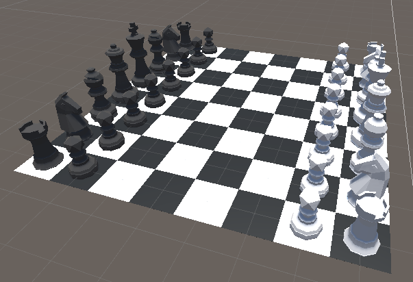
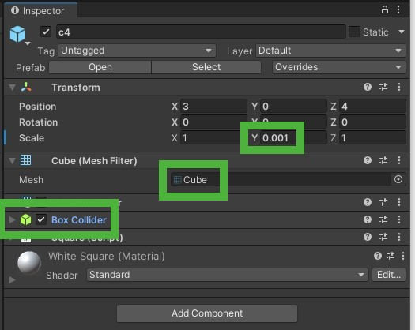
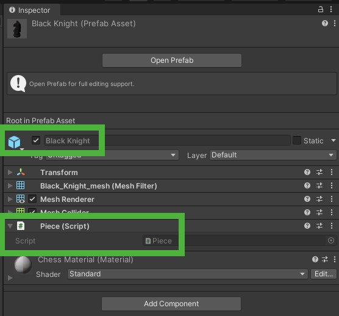
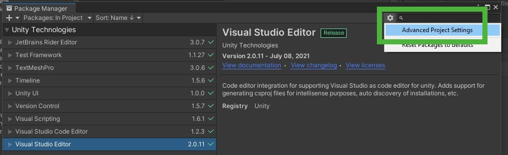
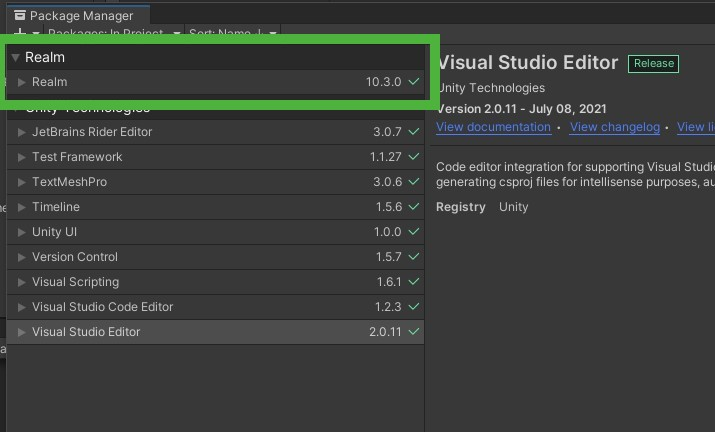

# Persistence in Unity using Realm

## Introduction

When creating a game with Unity we often reach the point where we need to save data that we need at a later point in time.

This could be something simple like a table of high scores or a lot more complex like the state of the game that got paused and now needs to be resumed exactly the way the user left it when they quit it earlier.

Maybe you have tried this before using `PlayerPrefs` but your data was too complex to save it in there. Or you have tried SQL only to find it to be very complicated and cumbersome to use.

Realm can help you achieve this easily and quickly with just some minor adjustments to your code.

The goal of this article is to show you how to add Realm to your Unity game and make sure your data is persisted.

The Realm Unity SDK is part of our [Realm .NET SDK](https://github.com/realm/realm-dotnet).

The [documentation for the Realm .NET SDK](https://docs.mongodb.com/realm/sdk/dotnet) will help you get started easily.

The next section will describe the example itself. If you are already familiar with Unity or really just want to see Realm in action you can also skip this part and [jump straight to the second section](#add-realm).

## Example game

We will be using a simple 3D chess game for demonstration purposes. Creating this game itself will not be part of this tutorial but if you want to follow along you can download it via [our Unity examples repository](https://github.com/realm/unity-examples-3d-chess/tree/example-template).

If you just want to have a look at [the final result](https://github.com/realm/unity-examples-3d-chess/tree/local-realm), it can be found there as well.

The Unity Editor version used for this example is `2021.1.13f1`.



To make it easy to find your way around this example, here are some notes to get you started:

The interesting part in the `MainScene` is to look at is the `Board`  which is made up of `Squares` and `Pieces`. The `Squares` are just slightly scaled and colored default `Cube` objects which we utilize to visualize the `Board` but also detect clicks for moving `Pieces` by using it's already attached `Box Collider` component.



Those `Pieces` have to be activated first though which happens by making them clickable as well. `Pieces` are not initially added to the `Board` but instead will be spawned by the `PieceSpawner`. You can find them in the `Prefabs` folder in the `Project` hierarchy.



The important part to look for here is the `Piece` script which detects clicks on this `Piece` (3) and offers a color change via `Select()` (1) and `Deselect()` (2) to visualize if a `Piece` is active or not.

```c#
using UnityEngine;

public class Piece : MonoBehaviour
{
    private Events events = default;
    private readonly Color selectedColor = new Color(1, 0, 0, 1);
    private readonly Color deselectedColor = new Color(1, 1, 1, 1);

    // 1
    public void Select()
    {
        gameObject.GetComponent<Renderer>().material.color = selectedColor;
    }

    // 2
    public void Deselect()
    {
        gameObject.GetComponent<Renderer>().material.color = deselectedColor;
    }

    // 3
    private void OnMouseDown()
    {
        events.PieceClickedEvent.Invoke(this);
    }

    private void Awake()
    {
        events = FindObjectOfType<Events>();
    }
}

```

We use two events to actually track the click on a `Piece` (1) or a `Square` (2):

```c#
using UnityEngine;
using UnityEngine.Events;

public class PieceClickedEvent : UnityEvent<Piece> { }
public class SquareClickedEvent : UnityEvent<Vector3> { }

public class Events : MonoBehaviour
{
    // 1
    public readonly PieceClickedEvent PieceClickedEvent = new PieceClickedEvent();
    // 2
    public readonly SquareClickedEvent SquareClickedEvent = new SquareClickedEvent();
}
```

The `InputListener` waits for those events to be invoked and will then notify other parts of our game about those updates. Pieces need to be selected when clicked (1) and deselected if another one was clicked (2).

Clicking a `Square` while a `Piece` is selected will send a message (3) to the `GameState` to update the position of this `Piece`.

```c#
using UnityEngine;

public class InputListener : MonoBehaviour
{
    [SerializeField] private Events events = default;
    [SerializeField] private GameState gameState = default;

    private Piece activePiece = default;

    private void OnEnable()
    {
        events.PieceClickedEvent.AddListener(OnPieceClicked);
        events.SquareClickedEvent.AddListener(OnSquareClicked);
    }

    private void OnDisable()
    {
        events.PieceClickedEvent.RemoveListener(OnPieceClicked);
        events.SquareClickedEvent.RemoveListener(OnSquareClicked);
    }

    private void OnPieceClicked(Piece piece)
    {
        if (activePiece != null)
        {
            // 2
            activePiece.Deselect();
        }
        // 1
        activePiece = piece;
        activePiece.Select();
    }

    private void OnSquareClicked(Vector3 position)
    {
        if (activePiece != null)
        {
            // 3
            gameState.MovePiece(activePiece, position);
            activePiece.Deselect();
            activePiece = null;
        }
    }
}

```

The actual movement as well as controlling the spawning and destroying of pieces is done by the `GameState` in which all the above information eventually comes together to update `Piece` positions and possibly destroy other `Piece` objects. Whenever we move a `Piece` (1) we not only update it's position (2) but also need to check if there is a `Piece` in that position already (3) and if so, destroy it (4).

In addition to updating the game while it is running the `GameState` offers two more functionalities:
- set up the initial board (5)
- reset the board to it's initial state (6)

```c#
using System.Linq;
using UnityEngine;

public class GameState : MonoBehaviour
{
    [SerializeField] private PieceSpawner pieceSpawner = default;
    [SerializeField] private GameObject pieces = default;

    // 1
    public void MovePiece(Piece movedPiece, Vector3 newPosition)
    {
        // 3
        // Check if there is already a piece at the new position and if so, destroy it.
        var attackedPiece = FindPiece(newPosition);
        if (attackedPiece != null)
        {
            // 4
            Destroy(attackedPiece.gameObject);
        }

        // 2
        // Update the movedPiece's GameObject.
        movedPiece.transform.position = newPosition;
    }

    // 6
    public void ResetGame()
    {
        // Destroy all GameObjects.
        foreach (var piece in pieces.GetComponentsInChildren<Piece>())
        {
            Destroy(piece.gameObject);
        }

        // Recreate the GameObjects.
        pieceSpawner.CreateGameObjects(pieces);
    }

    private void Awake()
    {
        // 5
        pieceSpawner.CreateGameObjects(pieces);
    }

    private Piece FindPiece(Vector3 position)
    {
        return pieces.GetComponentsInChildren<Piece>()
            .FirstOrDefault(piece => piece.transform.position == position);
    }
}
```

Go ahead and try it out yourself if you like. You can play around with the board and pieces and reset if you want to start all over again.

To make sure the example is not overly complex and easy to follow there are no rules implemented. You can move the pieces however you want. Also, the game is purely local for now and will be expanded using our Sync component in a later article to be playable online with others.

In the following section I will explain how to make sure that the current game state gets saved and the players can resume the game at any state.

## <a name="add-realm"></a>Adding Realm to your project

The first thing we need to do is to import the Realm framework into Unity.
The easiest way to do this is by using NPM.

You'll find it via `Windows` → `Package Manager` → cogwheel in the top right corner → `Advanced Project Settings`:



Within the `Scoped Registries` you can add the `Name`, `URL` and `Scope` as follows:


This adds `NPM` as a source for libraries. The final step is to tell the project which dependencies to actually integrate into the project. This is done in the `manifest.json` file which is located in the `Packages` folder of your project.

Here you need to add the following line to the `dependencies`:

```json
"io.realm.unity": "<version-number>"
```

Replace `<version-number>` with the most recent Realm version found in https://github.com/realm/realm-dotnet/releases and you're all set.

The final `manifest.json` should look something like this:

```json
{
 "dependencies": {
   ...
   "io.realm.unity": "10.3.0"
 },
 "scopedRegistries": [
   {
     "name": "NPM",
     "url": "https://registry.npmjs.org/",
     "scopes": [
       "io.realm.unity"
     ]
   }
 ]
}
```

When you switch back to Unity it will reload the dependencies. If you then open the `Package Manager` again, you should see `Realm` as a new entry in the list on the left:



We can now start using Realm in our Unity project.

## Setting up the board

The first thing we want to do is to define a Realm representation of our Piece since we cannot save the `PieceType` and the `Transform.Position` (which is a `Vector3`) directly in Realm.

Add the following script to the project:

```c#
using Realms; // 1
using UnityEngine;

public class PieceEntity : RealmObject // 2
{
    public int Type { get; set; } // 3

    // 4
    public float PositionX { get; set; }
    public float PositionY { get; set; }
    public float PositionZ { get; set; }
    
    // 5
    public PieceEntity()
    {
    
    }
    
    // 6
    public PieceEntity(PieceType type, Vector3 position)
    {
        // 7
        Type = (int)type;
        PositionX = position.x;
        PositionY = position.y;
        PositionZ = position.z;
    }
    
    // 8
    public Vector3 GetPosition()
    {
        return new Vector3(PositionX, PositionY, PositionZ);
    }
    
    // 9
    public void SetPosition(Vector3 position)
    {
        PositionX = position.x;
        PositionY = position.y;
        PositionZ = position.z;
    }

}
```

The first thing you'll notice is that we need to import the framework itself by calling `using Realms;` (1).

The way `Realm` knows which classes are representations of database tables is by deriving them from `RealmObject` (2).

We then define our fields, which need to be `primitive values`, in this case of type `int` for `Type` (3) and `float` for the three axis of the `Transform.Position` (4).

A constructor without any arguments is mandatory (5), we also add a convenience constructor (6) that takes a `PieceType` and a `Vector3` and takes care of the initialization of our four fields in this class (7).

Two more convenience functions, `GetPosition()` (8) and `SetPosition()` (9), will make the access and assignment of the position easier later.

The next step is to add some way to actually add `Pieces` to the `Realm`. The current database state will always represent the current state of the board. When we create a new `Piece`, for example when setting up the board, the entity for it will be created. If a `Piece` gets moved, the entity will be updated. If it gets destroyed, the corresponding entry gets deleted from the database table.

First, we will need to set up the board. The separate this from the `GameState` we create a new class that will take care of it:

```c#
using System.Linq;
using Realms;
using UnityEngine;

class Persistence
{
    public static IQueryable<PieceEntity> ResetDatabase(Realm realm)
    {
        realm.Write(() => // 3
        {
            realm.RemoveAll<PieceEntity>(); // 1

            // 2
            realm.Add(new PieceEntity(PieceType.WhiteRook, new Vector3(1, 0, 1)));
            realm.Add(new PieceEntity(PieceType.WhiteKnight, new Vector3(2, 0, 1)));
            realm.Add(new PieceEntity(PieceType.WhiteBishop, new Vector3(3, 0, 1)));
            realm.Add(new PieceEntity(PieceType.WhiteQueen, new Vector3(4, 0, 1)));
            realm.Add(new PieceEntity(PieceType.WhiteKing, new Vector3(5, 0, 1)));
            realm.Add(new PieceEntity(PieceType.WhiteBishop, new Vector3(6, 0, 1)));
            realm.Add(new PieceEntity(PieceType.WhiteKnight, new Vector3(7, 0, 1)));
            realm.Add(new PieceEntity(PieceType.WhiteRook, new Vector3(8, 0, 1)));

            realm.Add(new PieceEntity(PieceType.WhitePawn, new Vector3(1, 0, 2)));
            realm.Add(new PieceEntity(PieceType.WhitePawn, new Vector3(2, 0, 2)));
            realm.Add(new PieceEntity(PieceType.WhitePawn, new Vector3(3, 0, 2)));
            realm.Add(new PieceEntity(PieceType.WhitePawn, new Vector3(4, 0, 2)));
            realm.Add(new PieceEntity(PieceType.WhitePawn, new Vector3(5, 0, 2)));
            realm.Add(new PieceEntity(PieceType.WhitePawn, new Vector3(6, 0, 2)));
            realm.Add(new PieceEntity(PieceType.WhitePawn, new Vector3(7, 0, 2)));
            realm.Add(new PieceEntity(PieceType.WhitePawn, new Vector3(8, 0, 2)));

            realm.Add(new PieceEntity(PieceType.BlackPawn, new Vector3(1, 0, 7)));
            realm.Add(new PieceEntity(PieceType.BlackPawn, new Vector3(2, 0, 7)));
            realm.Add(new PieceEntity(PieceType.BlackPawn, new Vector3(3, 0, 7)));
            realm.Add(new PieceEntity(PieceType.BlackPawn, new Vector3(4, 0, 7)));
            realm.Add(new PieceEntity(PieceType.BlackPawn, new Vector3(5, 0, 7)));
            realm.Add(new PieceEntity(PieceType.BlackPawn, new Vector3(6, 0, 7)));
            realm.Add(new PieceEntity(PieceType.BlackPawn, new Vector3(7, 0, 7)));
            realm.Add(new PieceEntity(PieceType.BlackPawn, new Vector3(8, 0, 7)));

            realm.Add(new PieceEntity(PieceType.BlackRook, new Vector3(1, 0, 8)));
            realm.Add(new PieceEntity(PieceType.BlackKnight, new Vector3(2, 0, 8)));
            realm.Add(new PieceEntity(PieceType.BlackBishop, new Vector3(3, 0, 8)));
            realm.Add(new PieceEntity(PieceType.BlackQueen, new Vector3(4, 0, 8)));
            realm.Add(new PieceEntity(PieceType.BlackKing, new Vector3(5, 0, 8)));
            realm.Add(new PieceEntity(PieceType.BlackBishop, new Vector3(6, 0, 8)));
            realm.Add(new PieceEntity(PieceType.BlackKnight, new Vector3(7, 0, 8)));
            realm.Add(new PieceEntity(PieceType.BlackRook, new Vector3(8, 0, 8)));
        });

        return realm.All<PieceEntity>(); // 4
    }
}

```

This `ResetDatabase()` functionality can be used to initially set up the board on the first launch and also later when the user clicks the reset button. 

First remove all remaining objects from the `Realm` by calling `realm.RemoveAll<PieceEntity>()` (1), then we set up the initial state of a chess game via `realm.Add()` (2) where we pass in one newly created `PieceEntity` per call.

Notice that both these functions are called within a `realm.Write()` (3) statement which signals the `Realm` that data is about the be changed. Multiple `realm.Write()` calls block each other and therefore make sure that no two threads can change data at the same time which could lead to data corruption.

When the set up is complete we return the collection of all those objects which is represented by `realm.All<PieceEntity>()` (4).

The last step to create a new board is to update the `GameState` to make use of the `Persistance` and the `PieceEntity` that we just created.

First we also need to import Realm here as well:

```c#
using Realms;
```

Then we add a private field to save our `Realm` instance to avoid creating it over and over again. We also create another private field to save the collection of pieces that are on the board:

```c#
private Realm realm = default;
private IQueryable<PieceEntity> pieceEntities = default;
```

In `Awake` we do need to get access to the `Realm`. This is achieves by opening an instance of it (1) and then asking it for all `PieceEntity` objects currently saved using `realm.All` (2) and assigning them to our `pieceEntities` field.

Finally we check if objects already existed (3) and if not, we need to initialize the `Realm` by calling the just created `ResetDatabase()` (4). We will end up with a state where we either set up a new board or load the game state from the `Realm`.

Either way, it's now time to actually spawn the `GameObject`s that will represent the `PieceEntity` objects in our `Realm`. This will be achieved by calling `CreateDatabase()` as the last action in `Awake` (5).

```c#
private void Awake()
{
	realm = Realm.GetInstance(); // 1
    pieceEntities = realm.All<PieceEntity>(); // 2

    // Check if we already have PieceEntity's (which means we resume a game).
    if (pieceEntities.Count() == 0) // 3
    {
    	// No game was saved, create the necessary RealmObjects.
        pieceEntities = Persistence.ResetDatabase(realm); // 4
	}
    CreateGameObjects(); // 5
}
```

When creating the `GameObject`s for our `Realm` objects we just need to iterate (1) over the `pieceEntities` and create a new `Piece` for each of them by calling the `pieceSpawner` (2):

```c#
private void CreateGameObjects()
{
	// Each RealmObject needs a corresponding GameObject to represent it.
	foreach (PieceEntity pieceEntity in pieceEntities) // 1
	{
		PieceType type = (PieceType)pieceEntity.Type;
        Vector3 position = pieceEntity.GetPosition();
        pieceSpawner.SpawnPiece(type, position, pieces, pieceMovement); // 2
	}
}
```

Our game now resumes exactly where we stopped it and sets up the board accordingly.

However, when you stop and start the game again, you'll notice that the board will be reset to it's initial setup no matter where the pieces where positioned when you stopped it.

This is because we haven't saved our moves to the database yet which will be part of the next section.

## Updating the position of a PieceEntity

When moving a piece we need to adjust `UpdatePieceToPosition()` in `GameState` to not only update the scene but also the database:

```c#
public void UpdatePieceToPosition(Piece movedPiece, Vector3 newPosition)
{
    // Check if there is already a piece at the new position and if so, destroy it.
    var attackedPiece = FindPieceAtPosition(newPosition);
    if (attackedPiece != null)
    {
        var attackedPieceEntity = FindPieceEntityAtPosition(newPosition); // 1
        realm.Write(() => // 3
        {
            realm.Remove(attackedPieceEntity); // 2
        });
        Destroy(attackedPiece.gameObject);
    }

    // Update the movedPiece's RealmObject.
    var oldPosition = movedPiece.transform.position;
    var movedPieceEntity = FindPieceEntityAtPosition(oldPosition); // 4
    realm.Write(() =>
    {
        movedPieceEntity.SetPosition(newPosition); // 5
    });

    // Update the movedPiece's GameObject.
    movedPiece.transform.position = newPosition;
}
```

If there is an `attackedPiece` at the target position we need to delete the corresponding `Realm` entity for this `GameObject`. First we need to find the entity (1) and then delete it (2). Note that this is again a database change that needs to be wrapped in a write statement (3).

After the `attackedPiece` was updated we can then also update the `movedPiece`. Again, we first need to find the corresponding `PieceEntity` for this `GameObject` (4) and then set the new position (5).

In both cases the look up for `Realm` entities was done via the following function:

```c#
private PieceEntity FindPieceEntityAtPosition(Vector3 position)
{
    return pieceEntities.FirstOrDefault(piece => // 1
                        piece.PositionX == position.x &&
                        piece.PositionY == position.y &&
                        piece.PositionZ == position.z);
}
```

Whenever you need to search through a `Collection` of `RealmObject`s (which is an `IQueryable<PieceEntity>`) you can use `LINQ` on this `Collection`. By calling `FirstOrDefault` (1) and comparing the position, we retrieve the `RealmObject` for the `GameObject` in question.

This is all we had to do to update and persist the position. Go ahead and start the game. Stop and start it again and you should now see the state being persisted.

## Resetting the board

The final step will be to also update our `ResetGame` button so update the `Realm`. At the moment it does not update the state in the database and just calls the `CreateGameObjects` function that `PieceSpawner` provides.

Resetting works similar to what we do in `Awake`. After removing all `GameObject`s from the scene we also need to delete the `Realm` entities (1) and then call `CreateGameObjects()` (1) to set up the board again:

```c#
public void ResetGame()
{
    // Destroy all GameObjects.
    foreach (Piece piece in pieces.GetComponentsInChildren<Piece>())
    {
        Destroy(piece.gameObject);
    }

    // Re-create all RealmObjects with their initial position.
    pieceEntities = Persistence.ResetDatabase(realm); // 1

    // Recreate the GameObjects.
    CreateGameObjects(); // 2
}
```

After this change we can delete the `CreateGameObjects()` function from `PieceSpawner` since it is no longer needed and substituted by the same function in `GameState`.

With this change our game is finished and fully functional using a local `Realm` to save the game's state.

## Recap and Conclusion

In this tutorial we have seen that saving your game and resuming it later can be easily achieved by using `Realm`.

The steps we needed to take:

- Add `Realm` via NPM as a dependency.
- Import `Realm` in any class that wants to use it by calling `using Realms;`.
- Create a new `Realm` instance via `Realm.GetInstance() to get access to the database.
- Define entites by subclassing `RealmObject`:
  - Fields need to be public and primitive values or lists.
  - A default constructor is mandatory.
  - A convenience constructor and additional functions can be defined.
- Write to a `Realm` using `realm.Write()` to avoid data corruption.
- CRUD operations:
  - Use `realm.Add()` to `Create` a new object.
  - Use `realm.Remove()` to `Delete` an object.
  - `Read` and `Update` can be achieved by simple `getting` and `setting` the `public fields`.

With this you should be ready to use Realm in your games.

If you have questions, please head to our [developer community website](https://community.mongodb.com) where the MongoDB engineers and the MongoDB community will help you build your next big idea with MongoDB and Realm.
