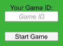

# Turning your local game into an online experience with Realm Sync

=== Outline ===

Introduction
  What do we want to achieve in this tutorial?
  Who is this tutorial for?
  (Who is it not for?)
  Which resources are interesting? (documentation in general)
  Which pre-requistes exist? (local Realm tutorial)
What is Realm Sync? (brief summary, not copy pasting the whole documentation)
  How does it work?
  What can it be used for?
How to set up Realm Sync? (maybe just a reference to the documentation)
  Creating a Realm app
  Enabling Sync
  Enabling an authentication method
  Enabling development mode
Example
  What game are we using to demonstrate that?
  Where can I find details about the game? -> first tutorial or complete overview again?
Model
  How do we have to change the model to make it work with Sync? (add _id)
Sync
  How do I open a synced Realm? (Realm.GetInstanceAsync())
  How do I synchronise the data? (automatically)
  What happens when data is updated? (notifications)
Enabling multiple games
  How can I create more than one game? (introduction to partitions and partition strategies)
  How should I create partiton keys? (Welcome screen to get a partiton key from the user == game id)
Let's play! (Testing)
  What is ParalleSync?
  How do I set it up?
  How do I use it?
Recap and Conclusion
  What have we learned in this tutorial?
  What are the steps we had to take to use Realm Sync?
  What's next? (the usual link to forum and dev hub)

=====


## Introduction

Single player games can be fun at times. But there is nothing more exciting than playing against real opponents.

Using Realm Sync you can easily synchronise data between multiple instances of your game.

In [another tutorial](https://github.com/realm/unity-examples-3d-chess/blob/local-realm/tutorial/unity_local_realm.md) we showed how to use a local Realm to persist your game's data. This tutorial will build on the local Realm to show how to easily transition to using Realm Sync.

If you have not used local Realms before I recommend working through the previous tutorial first so you can easily follow along here when we build on them.

## What is Realm Sync? How does it work?

todo: some general introduction

for the general documentation https://docs.mongodb.com/realm/sync/

## Setting up a Realm app and enabling Sync, enabling an authentication method and development mode


	

## Example

In this section I will briefly outline the example game that we are using to show how Sync works.

If you have seen it in detail in the [local Realm tutorial](https://github.com/realm/unity-examples-3d-chess/blob/local-realm/tutorial/unity_local_realm.md#example-game) already you can skip this. .....

```c#
using Realms;
using UnityEngine;

public class PieceEntity : RealmObject
{
    public PieceType PieceType
    {
        get => (PieceType)Type;
        private set => Type = (int)value;
    }

    public Vector3 Position
    {
        get => PositionEntity.ToVector3();
        set => PositionEntity = new Vector3Entity(value);
    }

    private int Type { get; set; }
    private Vector3Entity PositionEntity { get; set; }

    public PieceEntity(PieceType type, Vector3 position)
    {
        PieceType = type;
        Position = position;
    }

    protected override void OnPropertyChanged(string propertyName)
    {
        if (propertyName == nameof(PositionEntity))
        {
            RaisePropertyChanged(nameof(Position));
        }
    }

    private PieceEntity()
    {
    }
}
```


## Extending the model

The first thing we need to change to get the local Realm example ready for Sync is to [add an `id` to the `PieceType`](https://docs.mongodb.com/realm/sdk/dotnet/quick-start-with-sync/#define-your-object-model). The `id` is used by Sync to identify each objects and make sure it's unique.

```c#
using MongoDB.Bson;
```

```c#
[PrimaryKey]
[MapTo("_id")]
public ObjectId Id { get; set; } = ObjectId.GenerateNewId();
```

Note that you can name the property however you want but it must be mapped to `_id`. This is the property name used by Realm Sync.

This is all we need to change within the model itself. The next step will be to

## Who am I playing with? Partition strategy

The local Realm tutorial showed you how to create a persisted game locally. While you could play with someone else using the same game client, there was only ever one game at a time since every game is accessing the same table and therefore the same objects.

This would still be the same when using Realm Sync if we do not separate those games. Everyone accessing the game from wherever they are would see the same state. We need a way to create multiple games and identify which one we are playing. Realm Sync offers a feature that let's use achieve exactly this: partitions.

From the [documentation about partitions](https://docs.mongodb.com/realm/sync/partitions/):

```
A partition represents a subset of the documents in a synced cluster that are related in some way and have the same read/write permissions for a given user. Realm directly maps partitions to individual synced .realm files so each object in a synced realm has a corresponding document in the partition.
```

What does this mean for our game? If we use one partition per match we can make sure that only players using the same partition will actually play the same game. Furthermore, we can start as many games as we want. `Using the same partition` simply means using the same partiton key when opening a synced Realm. Partition keys are restricted to the following types: `String`, `ObjectID`, `Int`, `Long`.

For our game we will use a string that we ask the user for when they start the game. We will do this by adding a new scene to the game which also acts as a welcome and loading scene.



```c#
using Realms;
using Realms.Sync;
using System;
using System.IO;
using System.Threading.Tasks;
using UnityEngine;
using UnityEngine.SceneManagement;
using UnityEngine.UI;

public class StartGameButton : MonoBehaviour
{
    [SerializeField] private GameObject loadingIndicator = default;
    [SerializeField] private InputField gameIdInputField = default;

    public async void OnStartButtonClicked()
    {
        loadingIndicator.SetActive(true);

        var gameId = gameIdInputField.text;
        PlayerPrefs.SetString(Constants.PlayerPrefsKeys.GameId, gameId);

        await CreateRealmAsync(gameId);

        SceneManager.LoadScene(Constants.SceneNames.Main);
    }
}
```

welcome screen
game id
loading indicator

## Getting everything in Sync

Extend the `StartGameButton` with ....

```c#
private async Task CreateRealmAsync(string gameId)
{
    var app = App.Create(Constants.Realm.AppId);
    var user = app.CurrentUser;

    if (user == null)
    {
        var email = Guid.NewGuid().ToString();
        var password = Guid.NewGuid().ToString();
        await app.EmailPasswordAuth.RegisterUserAsync(email, password);
        user = await app.LogInAsync(Credentials.EmailPassword(email, password));
    }

    RealmConfiguration.DefaultConfiguration = new SyncConfiguration(gameId, user);

    if (!File.Exists(RealmConfiguration.DefaultConfiguration.DatabasePath))
    {
        using var realm = await Realm.GetInstanceAsync();
    }
}
```

## Let's play!

ParallelSync

## Recap and Conclusion